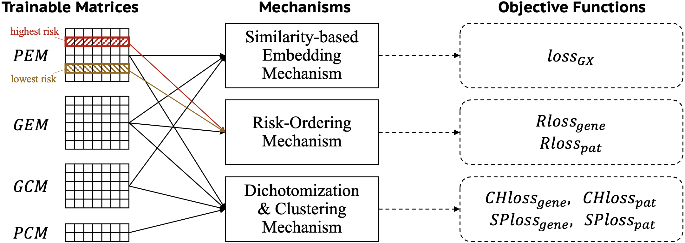
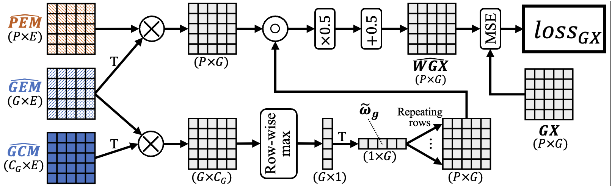
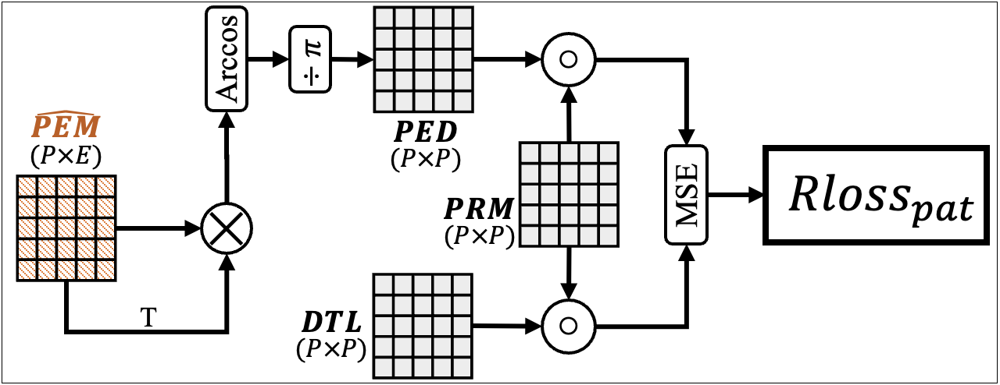
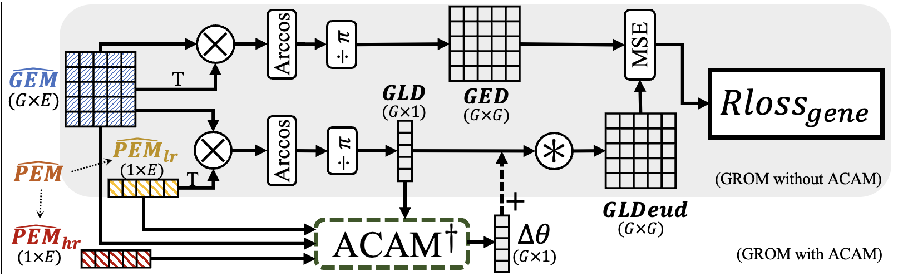
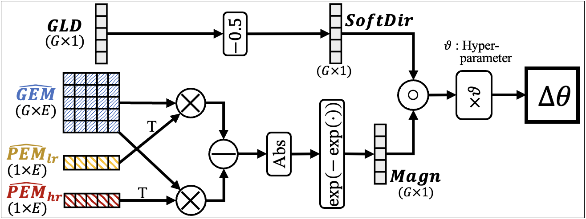

# SurProGenes

  This repository contains the Python code to replicate experiments in
  _**SurProGenes: Survival Risk-Ordered Representation of Cancer Patients and Genes for the Identification of Prognostic Genes**_.
  This paper presents a framework that recommends individual prognostic genes by integrating representation learning and statistical analysis.


## Model
  We propose a collaborative filtering-derived mechanism to represent patients in order of their survival risk and dichotomize them. The model consists of three novel mechanisms.
  <p align="center">
  
  </p>

### Similarity-based Embedding Mechanism (SEM)
  <p align="center">
  
  </p>

  $$loss_{GX}=\frac{1}{PG}\sum_{p=1}^{P}{\sum_{g=1}^{G}{(GX_{p,g}-\widehat{WGX}_{p,g})^2}}$$

### Risk-Ordering Mechanism (ROM)

1. Patient-oriented ROM (PROM)
  <p align="center">
  
  </p>

  $$Rloss_{pat}=\frac{1}{P^2}\sum_{i=1}^{P}{\sum_{j=1}^{P}{PRM_{i,j}(DTL_{i,j}-PED_{i,j})^2}}$$

2. Gene-oriented ROM (GROM)
  <p align="center">
  
  <em>GROM</em>
  
  <em>ACAM</em>
  </p>
  
  $$Rloss_{gene}=\frac{1}{G^2}\sum_{i=1}^{G}{\sum_{j=1}^{G}{(GLDeud_{i,j}-GED_{i,j})^2}}$$

### Dichotomization & Clustering Mechanism

  $$CHloss_{gene}=\frac{1}{G}\sum_{g=1}^{G}{\max{(D_{\theta}(GEM_{g},GCM)-\xi_{1},0)}}$$

  $$CHloss_{pat}=\frac{1}{P}\sum_{p=1}^{P}{\max{(D_{\theta}(PEM_{p},PCM)-\xi_{2},0)}}$$
  
  $$SPloss_{gene}=\frac{1}{C^G}\sum_{i=1}^{C^G}{\max{(\xi_{3}-(D_{\theta}^{s}(GCM))_{i},0)}}$$
  
  $$SPloss_{pat}=\frac{1}{C^P}\sum_{i=1}^{C^P}{\max{(\xi_{3}-(D_{\theta}^{s}(PCM))_{i},0)}}$$


## Data processing
  To obtain input data, execute [`1.DataProcessing_Raw.ipynb`](./1.Data/1.DataProcessing_Raw.ipynb) and
  [`2.DataProcessing_CoreProgenex_GroupNorm.ipynb`](./1.Data/2.DataProcessing_CoreProgenex_GroupNorm.ipynb) in
  [`1.Data/`](./1.Data/) folder.
  Then, you can get the following data in [`1.Data/ProcessedData/`](./1.Data/ProcessedData/) folder.
  
  - `StakedgData_GroupNorm.npy`
  - `GeneToInt_GroupNorm.npy`
  - `IntToGene_GroupNorm.npy`
  - `DisimInd_GroupNorm.npy`
  - `TTE_GroupNorm.npy`
  - `Event_GroupNorm.npy`
  - `LogAnalData.pickle`
  

## Prerequisites

  The code is implemented with the following dependencies:

  * python (v3.6)
  * numpy (v1.19)
  * tensorflow (v2.4)
  * tensorflow-gpu (v2.4)
  * jupyter
  * lifelines
  * matplotlib
  * pandas
  * scikit-learn
  * seaborn
  * statsmodels
  * venn


## Replicating the experiments of the paper

  1. Clone the repository.
  
  ```
  git clone https://github.com/JuntaeKim/SurProGenes.git
  ```
  
  2. Create a conda environment with all necessary libraries in **Prerequisites**.
  
(작성중)
